# 简介

一款开箱即用的BYOVD漏洞挖掘agent,exmaple中保存了测试报告。

测试用漏洞驱动来自https://github.com/BlackSnufkin/BYOVD


# 安装

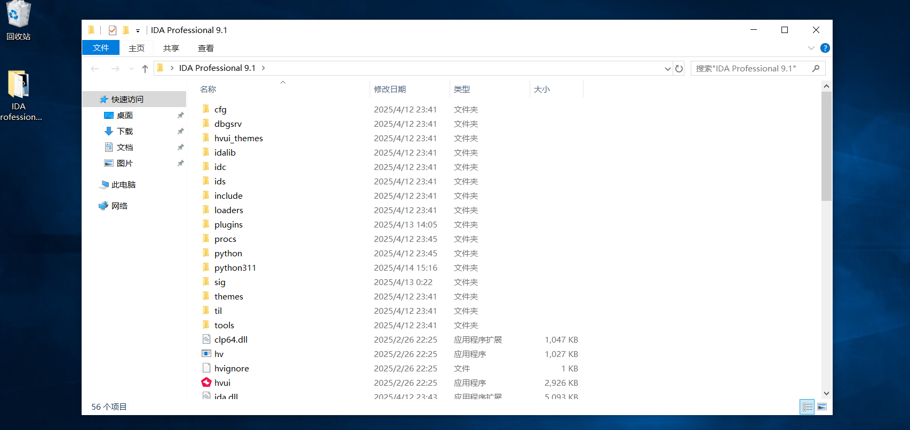

```
通过网盘分享的文件：IDA Professional 9.1.7z
链接: https://pan.baidu.com/s/1rEYPiskhbgjrQzegy0vgsA?pwd=zwbt 提取码: zwbt 
--来自百度网盘超级会员v6的分享
```

下载后解压，建议使用虚拟机


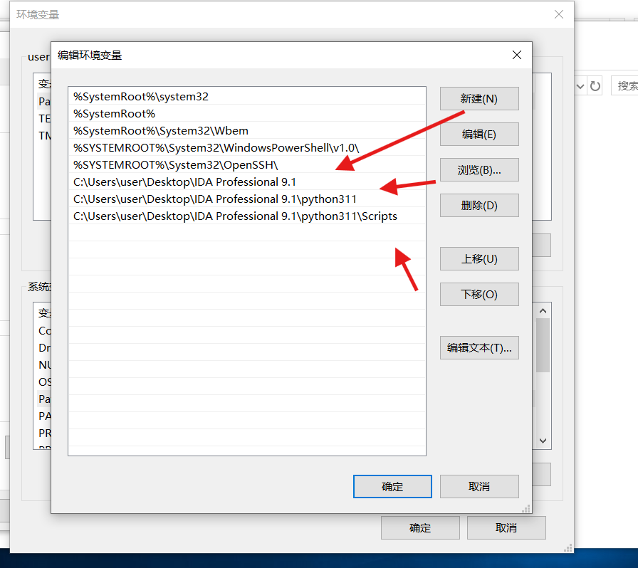

新增这三个环境变量


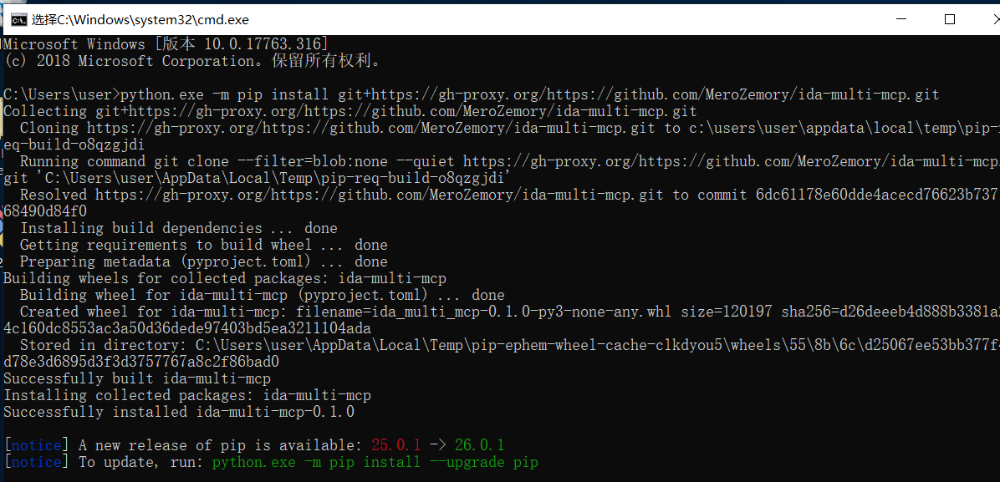

```
python.exe -m pip install git+https://github.com/MeroZemory/ida-multi-mcp.git
python.exe -m pip install --user git+https://github.com/MeroZemory/ida-multi-mcp.git
```

安装mcp，上图中使用了国内加速


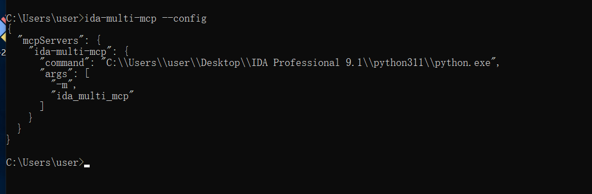

```
ida-multi-mcp --install
ida-multi-mcp --config
```

依次执行，最终得到config


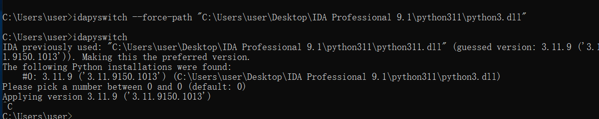

```
idapyswitch --force-path "C:\Users\user\Desktop\IDA Professional 9.1\python311\python3.dll"
```

配置ida识别python环境


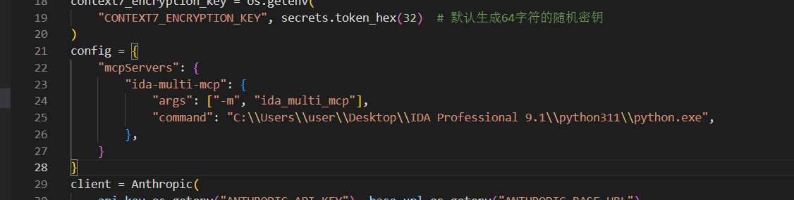

如上的方式写入agent.py中


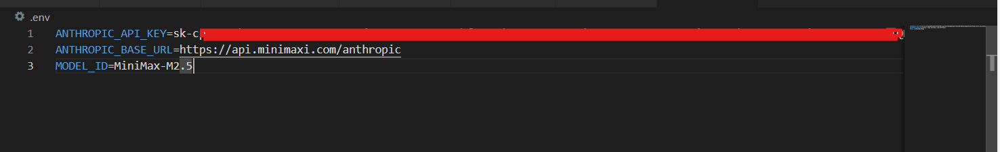

配置.env文件，尽量使用“聪明”的模型否则效果很差。


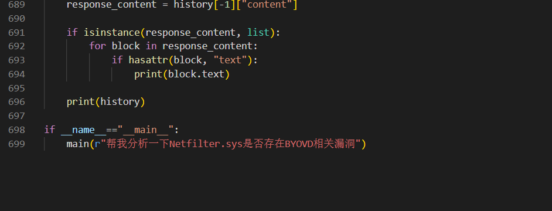

```
python -m pip install fastmcp anthropic
```

安装依赖并在agent.py中写入提示词即可


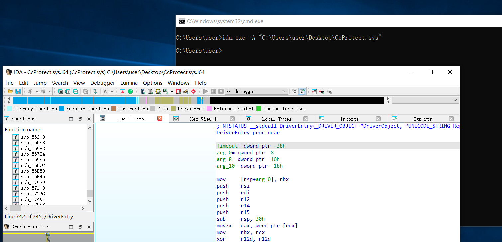

```
ida.exe -A "C:\Users\user\Desktop\CcProtect.sys"
```

在使用agent之前请先运行一次如上的命令打开一个项目，以此确保agent也能通过命令行打开实例


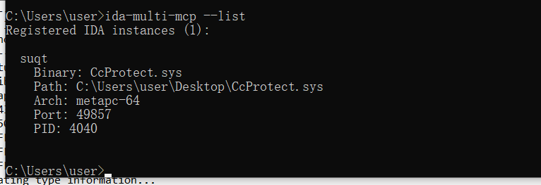

```
ida-multi-mcp --list
```

并且能查询到打开的实例


# todo自定义

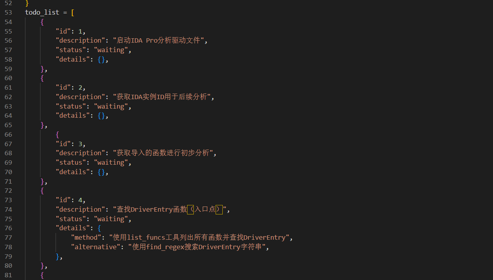

在todo_list中可定义分析过程，agent会依次执行


# 并行agent

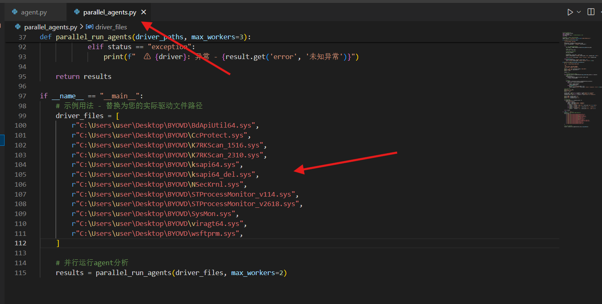

在parallel_agents.py中写入所有需要测试的驱动文件，也可以使用脚本生成。实际上就是多线程运行agent.py中的main函数


# 报告生成

报告样例在example目录中


# 声明


仅供教育用途,禁止非法渗透。
